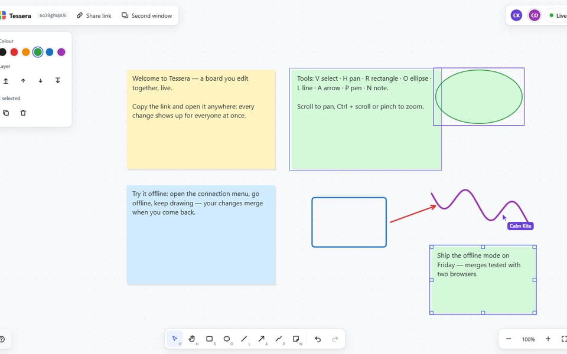
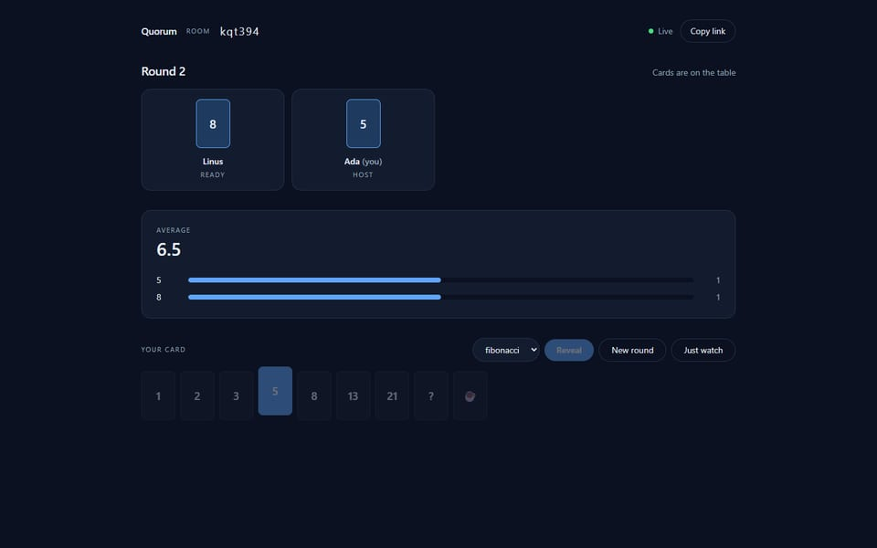
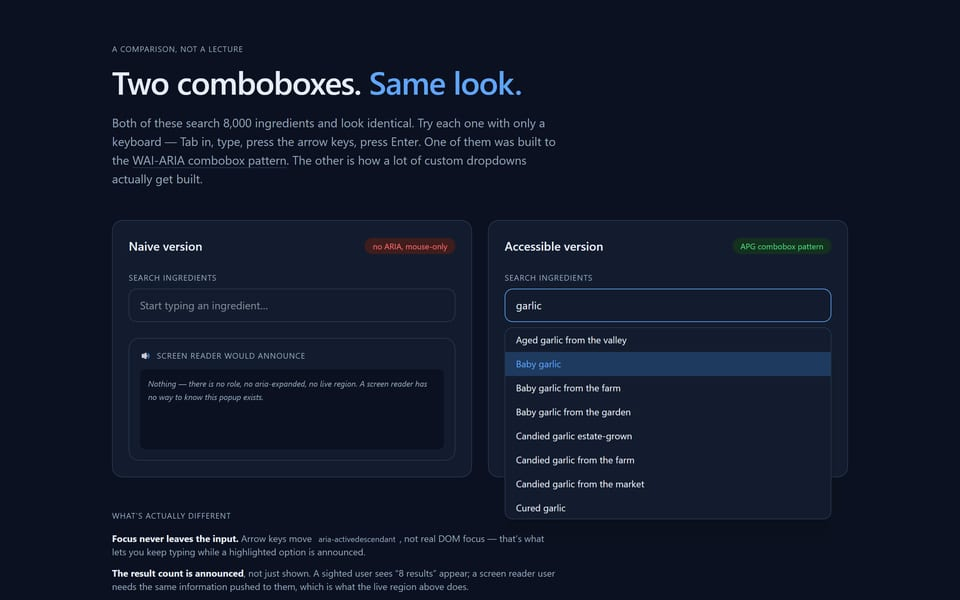
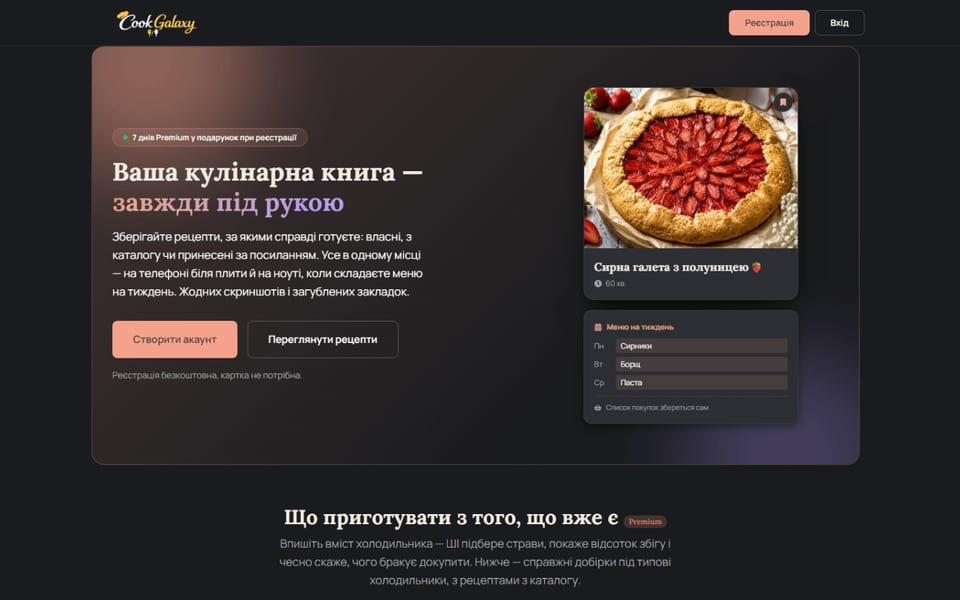

<picture>
  <source media="(prefers-color-scheme: dark)" srcset="assets/banner-dark.svg">
  
</picture>

  <a href="https://sk-portfilio.vercel.app"><b>Portfolio</b></a>&nbsp;&nbsp;·&nbsp;&nbsp;
  <a href="https://sk-portfilio.vercel.app/notes"><b>Notes</b></a>&nbsp;&nbsp;·&nbsp;&nbsp;
  <a href="https://www.linkedin.com/in/serhii-kusnetsov-032823343/"><b>LinkedIn</b></a>&nbsp;&nbsp;·&nbsp;&nbsp;
  <a href="https://t.me/Serhii_Kuznetsov05"><b>Telegram</b></a>&nbsp;&nbsp;·&nbsp;&nbsp;
  <a href="mailto:serhii.kuznetsov05@gmail.com"><b>Email</b></a>

Frontend developer working in React, Next.js and TypeScript. I'm drawn to the parts of the front end
that are hard to fake — state shared between people, rendering that stays fast at scale, interfaces
that work from the keyboard — and I prefer to prove things with measurements and tests rather than
adjectives. Open to full-time and freelance work.

## Selected work

<table>
  <tr>
    <td width="50%" valign="top">
      
      <h3><a href="https://github.com/f1erfly94/tessera">Tessera</a></h3>
      
A multiplayer whiteboard with the sync written from scratch: live cursors, offline edits that merge on reconnect, undo that only takes back your own changes. A simulation checks that every client converges.

      
<a href="https://tessera.flytomars94.workers.dev">Live</a> · <a href="https://github.com/f1erfly94/tessera">Code</a> · <a href="https://sk-portfilio.vercel.app/work/tessera">Case study</a>

      
Durable Objects · Canvas 2D · React · TypeScript

    </td>
    <td width="50%" valign="top">
      
      <h3><a href="https://github.com/f1erfly94/quorum-planning-poker">Quorum</a></h3>
      
Planning poker where votes stay hidden on the server until the reveal — there is nothing to find in the network tab. Presence, host handover and reconnection, tested with two browsers at once.

      
<a href="https://quorum-planning-poker.vercel.app">Live</a> · <a href="https://github.com/f1erfly94/quorum-planning-poker">Code</a> · <a href="https://sk-portfilio.vercel.app/work/quorum">Case study</a>

      
Cloudflare Workers · Durable Objects · Next.js · TypeScript

    </td>
  </tr>
  <tr>
    <td width="50%" valign="top">
      
      <h3><a href="https://github.com/f1erfly94/accessible-combobox">Accessible Combobox</a></h3>
      
The WAI-ARIA combobox pattern over 8,000 virtualised options, next to the naive version most dropdowns really are — and an honest look at what axe catches and what only keyboard tests do.

      
<a href="https://accessible-combobox.vercel.app">Live</a> · <a href="https://github.com/f1erfly94/accessible-combobox">Code</a> · <a href="https://sk-portfilio.vercel.app/work/accessible-combobox">Case study</a>

      
Next.js · TypeScript · Playwright · axe-core

    </td>
    <td width="50%" valign="top">
      
      <h3><a href="https://cook-galaxy.vercel.app">Cook Galaxy</a></h3>
      
A full-stack recipe and meal-planning product: AI import from a photo or a link, meal plans that build their own shopping list, subscriptions, and an Expo app on the same backend.

      
<a href="https://cook-galaxy.vercel.app">Live</a> · <a href="https://sk-portfilio.vercel.app/work/cook-galaxy">Case study</a> · private code

      
Next.js · Prisma · PostgreSQL · Expo · Gemini

    </td>
  </tr>
</table>

Also: [KLYK-65](https://klyk-3d-keyboard.vercel.app), a 3D keyboard rendered in WebGL without a single
model file, and more on the [portfolio](https://sk-portfilio.vercel.app/work).

## Things I wrote down

- **[The lag my test browser could not see](https://sk-portfilio.vercel.app/notes/the-lag-my-test-browser-could-not-see)** —
  headless Chrome draws at 60 fps, so on a 165 Hz screen it hid a 146 ms frame.
- **[AnimatePresence and the pages that went blank](https://sk-portfilio.vercel.app/notes/animatepresence-and-the-blank-pages)** —
  30 of 40 navigations ended on a page that was there but invisible.
- **[The counter that reset "4 years" to zero](https://sk-portfilio.vercel.app/notes/the-counter-that-reset-to-zero)** —
  two halves of one library disagreeing about when to start.

## Toolbox

- **Front end** — React · Next.js · TypeScript · Tailwind CSS · Framer Motion · Canvas 2D · three.js
- **Real-time and data** — Cloudflare Workers · Durable Objects · WebSockets · Prisma · PostgreSQL · TanStack Query
- **Quality** — Playwright · Vitest · Jest · axe-core · GitHub Actions
- **Mobile** — Expo · React Native
